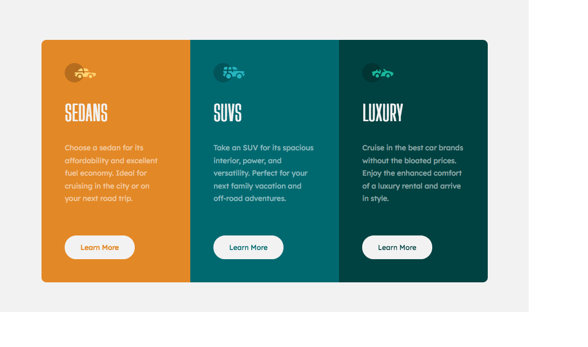

# Frontend Mentor - 3-column preview card component solution

This is a solution to the [3-column preview card component challenge on Frontend Mentor](https://www.frontendmentor.io/challenges/3column-preview-card-component-pH92eAR2-). Frontend Mentor challenges help you improve your coding skills by building realistic projects.

## Table of contents

- [Overview](#overview)
  - [The challenge](#the-challenge)
  - [FInal Result](#final-result)
  - [Links](#links)
- [My process](#my-process)
  - [Built with](#built-with)
  - [Project Structure](#project-structure)
- [Author](#author)

## Overview

### The challenge

Users should be able to:

- View the optimal layout depending on their device's screen size
- See hover states for interactive elements

### Final Result



### Links

- [Solution URL](https://github.com/mspavanelli/frontendmentor-3-column-preview-card-component)
- [Live Site URL](https://mspavanelli.github.io/frontendmentor-3-column-preview-card-component/)

## My process

### Built with

- Semantic HTML5 markup
- CSS custom properties
- Flexbox
- CSS Grid

### Project Structure

```
📦 App
┣ 📂 styles
┃ ┣ 📂 css
┃ ┃ ┣ 📄 base.css
┃ ┃ ┣ 📄 components.css
┃ ┃ ┣ 📄 layouts.css
┃ ┃ ┣ 📄 mobile.css
┃ ┃ ┗ 📄 normalize.css
┃ ┗ 📄 index.css
┣ 📄 index.html
```

## Author

- Website - [Matheus Pavanelli](http://mspavanelli.github.io/)
- Frontend Mentor - [@mspavanelli](https://www.frontendmentor.io/profile/mspavanelli)
